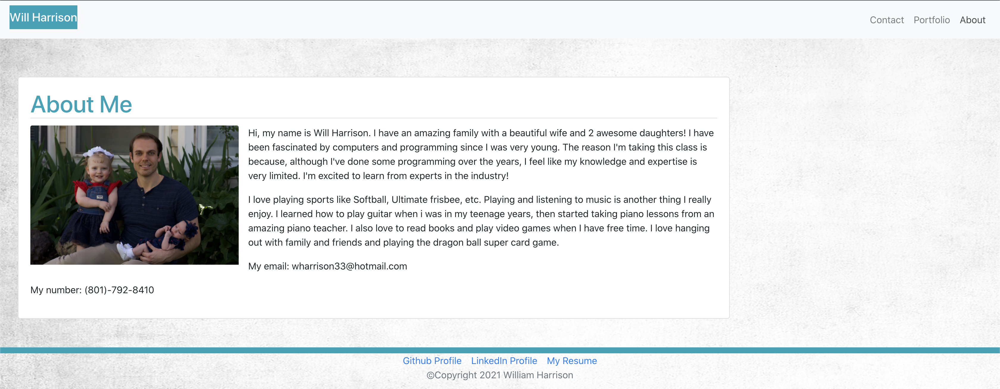

# React Portfolio

<a href="https://lit-depths-97924.herokuapp.com/">Deployed Application</a>

## Description
This is my portfolio converted to React!

## Table of Contents
* [Installation](#installation)
* [Usage](#usage)
* [License](#license)
* [Contributing](#contributing)
* [Tests](#tests)
* [Questions](#questions)

## Installation
To install the necessary dependencies, run the following command

`yarn install`

## Usage

Go ahead and pull down, install dependencies and pull it up!

## License
This project is licensed under MIT

## Contributing
You can just fork the repo and submit merge request when ready to contribute!

## Tests
To run tests, run the following command

`yarn run test`

## Questions
If you have questions about the repo, open an issue or contact me directly at wharrison33@hotmail.com. You can find more of my work at willh33
  